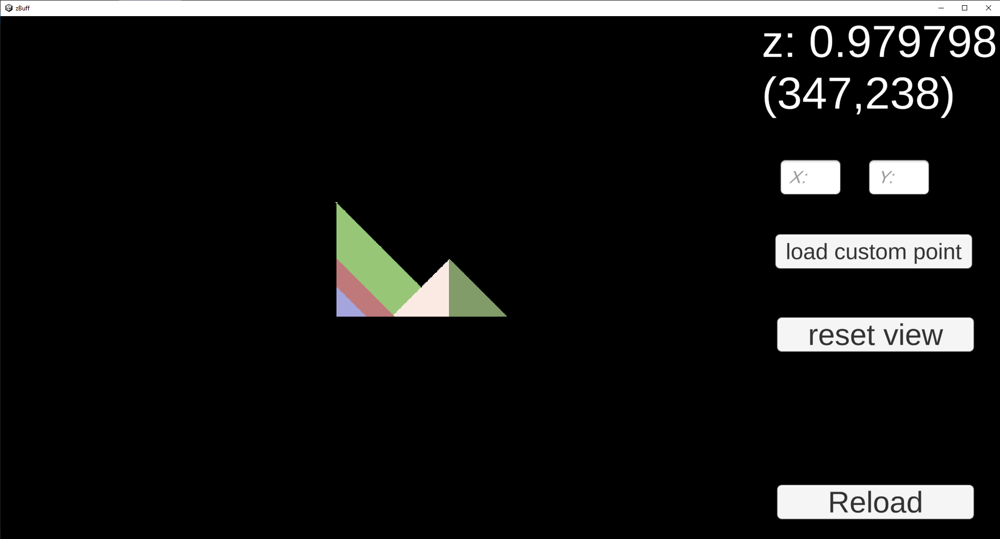

# ZBufferDebugger
load and visualize for cse 410 offline becausing debugging that thing in text is hell.
# Usage:

Hover over a pixel to see z buffer values.
WASD to pan camera, zoom via scroll wheel.
The buttons are self-explanatory.

# Req:
1. print all zbuffer and framebuffer values to z_buffer_all.txt f_buffer_all.txt
2. Files must be in same folder as zBuff.exe
3. run zBuff.exe

Color class printed like so:
```
class Color{
public:
    int r;
    int g;
    int b;

    friend ostream &operator<<(ostream &os, const Color &color) {
        os << color.r << " " << color.g << " " << color.b;
        return os;
    }
}
```
Print to files by separating them via commas:
```
ofstream zbuffOut("z_buffer_all.txt");
ofstream fbuffOut("f_buffer_all.txt");
for (int i = 0; i < screenWidth; ++i) {
    for (int j = 0; j < screenHeight; ++j) {
        zbuffOut << zBuffer[i][j] << ",";
        fbuffOut << frameBuffer[i][j] << ",";
    }
    zbuffOut << endl;
    fbuffOut << endl;
}
zbuffOut.close();
fbuffOut.close();
```
